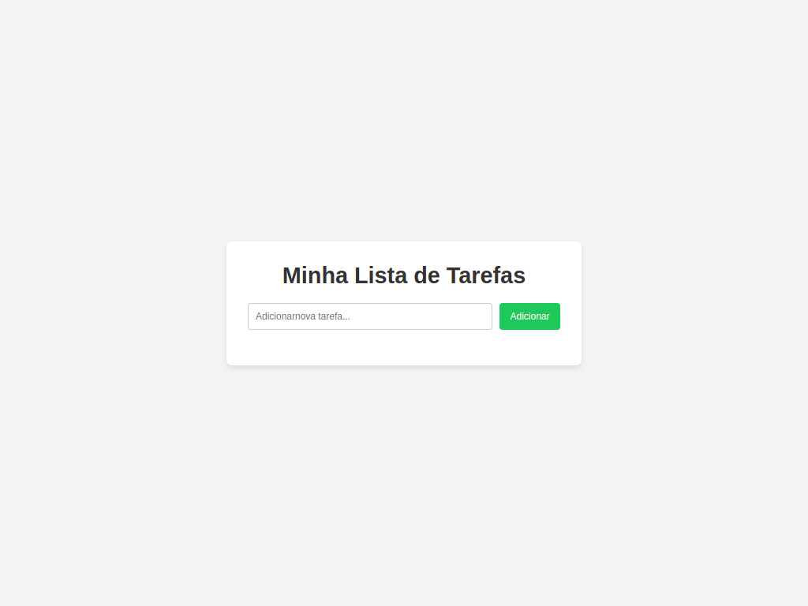
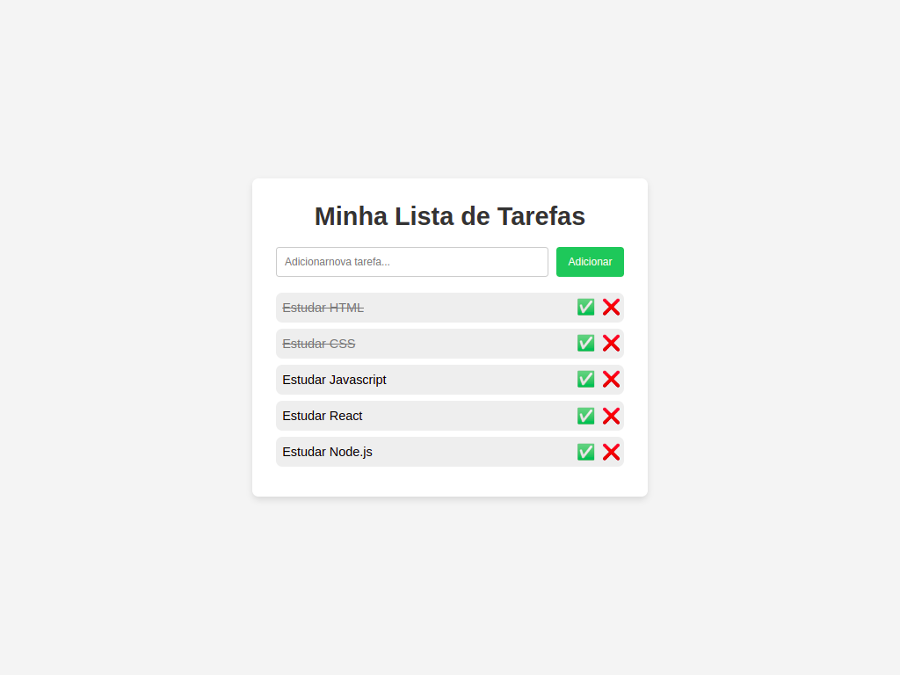

# 📝 ToDo List JS

Uma aplicação de lista de tarefas simples e funcional, desenvolvida para colocar em prática conceitos fundamentais de manipulação do DOM e lógica de programação com JavaScript.

## 🚀 Funcionalidades

- **Adicionar Tarefas:** Digite uma tarefa e adicione à lista instantaneamente.
- **Marcar como Concluída:** Clique na tarefa para indicar que foi finalizada.
- **Remover Tarefas:** Exclua itens da lista de forma individual.
- **Interface Responsiva:** Adaptada para diferentes tamanhos de tela.
<!-- - **Persistência (Opcional):** _(Se você usou LocalStorage, mencione aqui que os dados não somem ao atualizar a página)_. -->

## 🛠️ Tecnologias Utilizadas

O projeto foi construído utilizando as tecnologias web fundamentais:

- **HTML5:** Estruturação semântica do conteúdo.
- **CSS3:** Estilização, layout (Flexbox) e responsividade.
- **JavaScript (ES6+):** Lógica de manipulação do DOM, eventos e funções.

## 📸 Demonstração

**_Sem tarefas_**

<P align="center">

</p>
<br/>

**_Com tarefas_**

<P align="center">

</p> -->

## ⚙️ Como executar o projeto

Para visualizar o projeto localmente, basta seguir os passos abaixo:

1. Clone este repositório:

```bash
git clone https://github.com/aldosds/todo-list-js.git

```

2. Navegue até a pasta do projeto:

```bash
cd nome-do-repositorio

```

3. Abra o arquivo `index.html` no seu navegador de preferência.

---

## 🏗️ Melhorias Futuras

- [ ] Adicionar Editar.
- [ ] Adicionar filtro de tarefas (Todas, Ativas, Concluídas).
- [ ] Implementar modo escuro (Dark Mode).
<!-- - [ ] Adicionar animações ao inserir ou deletar itens. -->

---

Feito com ❤️ por Aldo Santos

---
